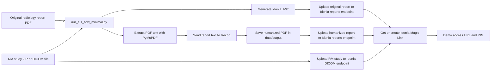

# Architecture Diagram

Minimal current flow for the Reto Idonia hackathon delivery.

Notes:

- Idonia calls use JWT Bearer authentication.
- Recog calls use `X-API-Key`.
- Generated PDFs and medical data stay under ignored local folders.
